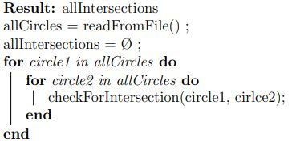

<!-- PROJECT LOGO -->
 

  <h1 align="center">Circle intersection algorithm using a sweep line</h1>

  

    Given a text file with one each line the coordinate of the center and the radius of each circle, find all the intersections of the given circles and write their coordinates to a text file.
     
     
  

<!-- ABOUT THE PROJECT -->
## About The Project

The program reads the text file with the given circles and stores them. Then, it is possible to call one of three methods to calculate the intersections of the circles:
* The first algorithm is a brute force approach which calculates for each circle if it has intersections with every other circle. The time complexity is `O(n²)` 

* The second algorithm is a naive sweep line algorithm which uses a priority queue to store the currently active circles and checks for intersections between the newly added circle and all the other circles in the queue whenever a new circle is added. The worst-case time complexity is `O(n²)`.
* The third algorithm is an efficient sweep line algorithm which uses a binary search tree to store the currently active circles and checks for intersections between a circle and its neighbouring circles in the tree whenever the circle is added to the tree, whenever an intersection occurs and whenever a circle is removed from the tree. The time complexity is `O(n.log(n))` 

### Built With
* [Java](https://www.java.com/)
* [JavaFX](https://openjfx.io/)

<!-- GETTING STARTED -->
## Getting Started

Open in.txt file. On the first line the number of the algorithm to find the circle intersections is put. On the ohter lines, the coordinates of the circles and the radius are put in a double format. Finally, run the program and the coordinates of the intersections will be written in the out.txt file alongside the runtime in ms. A gui will also appear which will draw the circles given with the found intersections drawn in red.

<!-- LICENSE -->
## License

Distributed under the MIT License.

